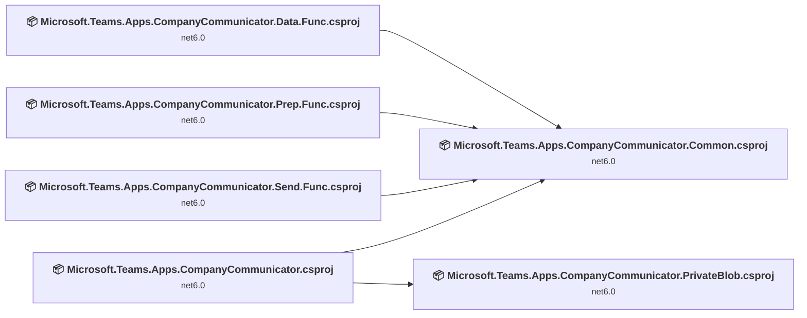
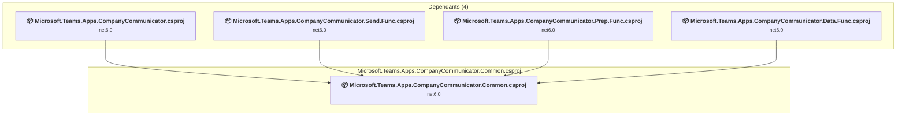
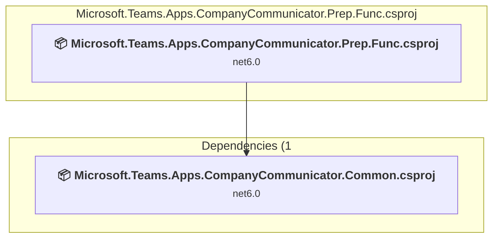
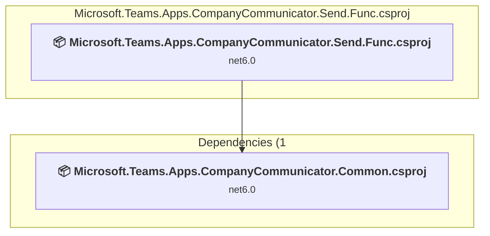
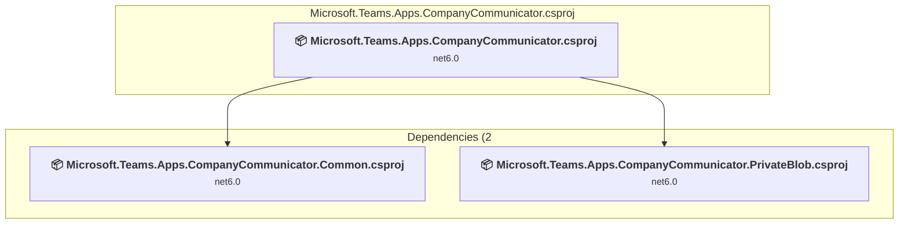
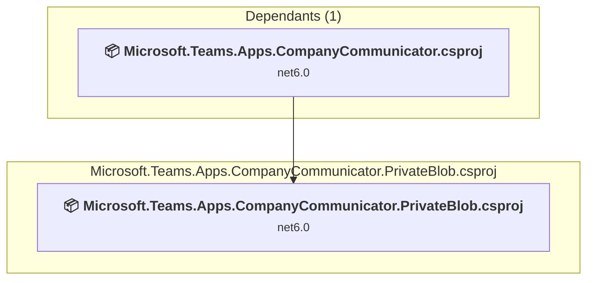

# Projects and dependencies analysis

This document provides a comprehensive overview of the projects and their dependencies in the context of upgrading to .NETCoreApp,Version=v8.0.

## Table of Contents

- [Executive Summary](#executive-Summary)
  - [Highlevel Metrics](#highlevel-metrics)
  - [Projects Compatibility](#projects-compatibility)
  - [Package Compatibility](#package-compatibility)
  - [API Compatibility](#api-compatibility)
- [Aggregate NuGet packages details](#aggregate-nuget-packages-details)
- [Top API Migration Challenges](#top-api-migration-challenges)
  - [Technologies and Features](#technologies-and-features)
  - [Most Frequent API Issues](#most-frequent-api-issues)
- [Projects Relationship Graph](#projects-relationship-graph)
- [Project Details](#project-details)

  - [CompanyCommunicator.Common\Microsoft.Teams.Apps.CompanyCommunicator.Common.csproj](#companycommunicatorcommonmicrosoftteamsappscompanycommunicatorcommoncsproj)
  - [CompanyCommunicator.Data.Func\Microsoft.Teams.Apps.CompanyCommunicator.Data.Func.csproj](#companycommunicatordatafuncmicrosoftteamsappscompanycommunicatordatafunccsproj)
  - [CompanyCommunicator.Prep.Func\Microsoft.Teams.Apps.CompanyCommunicator.Prep.Func.csproj](#companycommunicatorprepfuncmicrosoftteamsappscompanycommunicatorprepfunccsproj)
  - [CompanyCommunicator.Send.Func\Microsoft.Teams.Apps.CompanyCommunicator.Send.Func.csproj](#companycommunicatorsendfuncmicrosoftteamsappscompanycommunicatorsendfunccsproj)
  - [CompanyCommunicator\Microsoft.Teams.Apps.CompanyCommunicator.csproj](#companycommunicatormicrosoftteamsappscompanycommunicatorcsproj)
  - [Microsoft.Teams.Apps.CompanyCommunicator.PrivateBlob\Microsoft.Teams.Apps.CompanyCommunicator.PrivateBlob.csproj](#microsoftteamsappscompanycommunicatorprivateblobmicrosoftteamsappscompanycommunicatorprivateblobcsproj)

## Executive Summary

### Highlevel Metrics

| Metric | Count | Status |
| :--- | :---: | :--- |
| Total Projects | 6 | All require upgrade |
| Total NuGet Packages | 32 | 16 need upgrade |
| Total Code Files | 271 |  |
| Total Code Files with Incidents | 9 |  |
| Total Lines of Code | 23389 |  |
| Total Number of Issues | 56 |  |
| Estimated LOC to modify | 5+ | at least 0.0% of codebase |

### Projects Compatibility

| Project | Target Framework | Difficulty | Package Issues | API Issues | Est. LOC Impact | Description |
| :--- | :---: | :---: | :---: | :---: | :---: | :--- |
| [CompanyCommunicator.Common\Microsoft.Teams.Apps.CompanyCommunicator.Common.csproj](#companycommunicatorcommonmicrosoftteamsappscompanycommunicatorcommoncsproj) | net6.0 | 🟢 Low | 5 | 2 | 2+ | ClassLibrary, Sdk Style = True |
| [CompanyCommunicator.Data.Func\Microsoft.Teams.Apps.CompanyCommunicator.Data.Func.csproj](#companycommunicatordatafuncmicrosoftteamsappscompanycommunicatordatafunccsproj) | net6.0 | 🟢 Low | 8 | 0 |  | ClassLibrary, Sdk Style = True |
| [CompanyCommunicator.Prep.Func\Microsoft.Teams.Apps.CompanyCommunicator.Prep.Func.csproj](#companycommunicatorprepfuncmicrosoftteamsappscompanycommunicatorprepfunccsproj) | net6.0 | 🟢 Low | 9 | 0 |  | ClassLibrary, Sdk Style = True |
| [CompanyCommunicator.Send.Func\Microsoft.Teams.Apps.CompanyCommunicator.Send.Func.csproj](#companycommunicatorsendfuncmicrosoftteamsappscompanycommunicatorsendfunccsproj) | net6.0 | 🟢 Low | 7 | 0 |  | ClassLibrary, Sdk Style = True |
| [CompanyCommunicator\Microsoft.Teams.Apps.CompanyCommunicator.csproj](#companycommunicatormicrosoftteamsappscompanycommunicatorcsproj) | net6.0 | 🟢 Low | 11 | 3 | 3+ | AspNetCore, Sdk Style = True |
| [Microsoft.Teams.Apps.CompanyCommunicator.PrivateBlob\Microsoft.Teams.Apps.CompanyCommunicator.PrivateBlob.csproj](#microsoftteamsappscompanycommunicatorprivateblobmicrosoftteamsappscompanycommunicatorprivateblobcsproj) | net6.0 | 🟢 Low | 2 | 0 |  | ClassLibrary, Sdk Style = True |

### Package Compatibility

| Status | Count | Percentage |
| :--- | :---: | :---: |
| ✅ Compatible | 16 | 50.0% |
| ⚠️ Incompatible | 6 | 18.8% |
| 🔄 Upgrade Recommended | 10 | 31.3% |
| ***Total NuGet Packages*** | ***32*** | ***100%*** |

### API Compatibility

| Category | Count | Impact |
| :--- | :---: | :--- |
| 🔴 Binary Incompatible | 5 | High - Require code changes |
| 🟡 Source Incompatible | 0 | Medium - Needs re-compilation and potential conflicting API error fixing |
| 🔵 Behavioral change | 0 | Low - Behavioral changes that may require testing at runtime |
| ✅ Compatible | 14353 |  |
| ***Total APIs Analyzed*** | ***14358*** |  |

## Aggregate NuGet packages details

| Package | Current Version | Suggested Version | Projects | Description |
| :--- | :---: | :---: | :--- | :--- |
| AdaptiveCards | 1.0.6 |  | [Microsoft.Teams.Apps.CompanyCommunicator.Common.csproj](#companycommunicatorcommonmicrosoftteamsappscompanycommunicatorcommoncsproj) | ✅Compatible |
| Azure.Storage.Blobs | 12.8.0 | 12.27.0 | [Microsoft.Teams.Apps.CompanyCommunicator.Common.csproj](#companycommunicatorcommonmicrosoftteamsappscompanycommunicatorcommoncsproj) [Microsoft.Teams.Apps.CompanyCommunicator.csproj](#companycommunicatormicrosoftteamsappscompanycommunicatorcsproj) [Microsoft.Teams.Apps.CompanyCommunicator.Data.Func.csproj](#companycommunicatordatafuncmicrosoftteamsappscompanycommunicatordatafunccsproj) [Microsoft.Teams.Apps.CompanyCommunicator.Prep.Func.csproj](#companycommunicatorprepfuncmicrosoftteamsappscompanycommunicatorprepfunccsproj) [Microsoft.Teams.Apps.CompanyCommunicator.PrivateBlob.csproj](#microsoftteamsappscompanycommunicatorprivateblobmicrosoftteamsappscompanycommunicatorprivateblobcsproj) | NuGet package contains security vulnerability |
| CsvHelper | 15.0.5 |  | [Microsoft.Teams.Apps.CompanyCommunicator.Prep.Func.csproj](#companycommunicatorprepfuncmicrosoftteamsappscompanycommunicatorprepfunccsproj) | ✅Compatible |
| Microsoft.ApplicationInsights.AspNetCore | 2.17.0 |  | [Microsoft.Teams.Apps.CompanyCommunicator.csproj](#companycommunicatormicrosoftteamsappscompanycommunicatorcsproj) | ⚠️NuGet package is deprecated |
| Microsoft.AspNetCore.Authentication.AzureAD.UI | 3.1.1 |  | [Microsoft.Teams.Apps.CompanyCommunicator.csproj](#companycommunicatormicrosoftteamsappscompanycommunicatorcsproj) | Needs to be replaced with Replace with new package Microsoft.Identity.Web=4.9.0 |
| Microsoft.AspNetCore.Authentication.JwtBearer | 3.1.4 | 8.0.26 | [Microsoft.Teams.Apps.CompanyCommunicator.csproj](#companycommunicatormicrosoftteamsappscompanycommunicatorcsproj) | NuGet package upgrade is recommended |
| Microsoft.AspNetCore.Authentication.OpenIdConnect | 3.1.4 | 8.0.26 | [Microsoft.Teams.Apps.CompanyCommunicator.csproj](#companycommunicatormicrosoftteamsappscompanycommunicatorcsproj) | NuGet package upgrade is recommended |
| Microsoft.AspNetCore.SpaServices.Extensions | 3.1.1 | 8.0.26 | [Microsoft.Teams.Apps.CompanyCommunicator.csproj](#companycommunicatormicrosoftteamsappscompanycommunicatorcsproj) | NuGet package upgrade is recommended |
| Microsoft.Azure.Cosmos.Table | 1.0.1 |  | [Microsoft.Teams.Apps.CompanyCommunicator.Common.csproj](#companycommunicatorcommonmicrosoftteamsappscompanycommunicatorcommoncsproj) | ⚠️NuGet package is deprecated |
| Microsoft.Azure.Functions.Extensions | 1.1.0 |  | [Microsoft.Teams.Apps.CompanyCommunicator.Data.Func.csproj](#companycommunicatordatafuncmicrosoftteamsappscompanycommunicatordatafunccsproj) [Microsoft.Teams.Apps.CompanyCommunicator.Prep.Func.csproj](#companycommunicatorprepfuncmicrosoftteamsappscompanycommunicatorprepfunccsproj) [Microsoft.Teams.Apps.CompanyCommunicator.Send.Func.csproj](#companycommunicatorsendfuncmicrosoftteamsappscompanycommunicatorsendfunccsproj) | ✅Compatible |
| Microsoft.Azure.ServiceBus | 4.1.1 |  | [Microsoft.Teams.Apps.CompanyCommunicator.Common.csproj](#companycommunicatorcommonmicrosoftteamsappscompanycommunicatorcommoncsproj) | ⚠️NuGet package is deprecated |
| Microsoft.Azure.Storage.Blob | 11.2.3 |  | [Microsoft.Teams.Apps.CompanyCommunicator.csproj](#companycommunicatormicrosoftteamsappscompanycommunicatorcsproj) | ⚠️NuGet package is deprecated |
| Microsoft.Azure.WebJobs.Extensions.DurableTask | 2.3.0 |  | [Microsoft.Teams.Apps.CompanyCommunicator.Prep.Func.csproj](#companycommunicatorprepfuncmicrosoftteamsappscompanycommunicatorprepfunccsproj) | NuGet package functionality is included with framework reference |
| Microsoft.Azure.WebJobs.Extensions.ServiceBus | 3.0.3 |  | [Microsoft.Teams.Apps.CompanyCommunicator.Data.Func.csproj](#companycommunicatordatafuncmicrosoftteamsappscompanycommunicatordatafunccsproj) [Microsoft.Teams.Apps.CompanyCommunicator.Prep.Func.csproj](#companycommunicatorprepfuncmicrosoftteamsappscompanycommunicatorprepfunccsproj) [Microsoft.Teams.Apps.CompanyCommunicator.Send.Func.csproj](#companycommunicatorsendfuncmicrosoftteamsappscompanycommunicatorsendfunccsproj) | NuGet package functionality is included with framework reference |
| Microsoft.Azure.WebJobs.Host.Storage | 3.0.14 |  | [Microsoft.Teams.Apps.CompanyCommunicator.Data.Func.csproj](#companycommunicatordatafuncmicrosoftteamsappscompanycommunicatordatafunccsproj) [Microsoft.Teams.Apps.CompanyCommunicator.Prep.Func.csproj](#companycommunicatorprepfuncmicrosoftteamsappscompanycommunicatorprepfunccsproj) [Microsoft.Teams.Apps.CompanyCommunicator.Send.Func.csproj](#companycommunicatorsendfuncmicrosoftteamsappscompanycommunicatorsendfunccsproj) | NuGet package functionality is included with framework reference |
| Microsoft.Bot.Builder.Integration.AspNet.Core | 4.12.1 |  | [Microsoft.Teams.Apps.CompanyCommunicator.Common.csproj](#companycommunicatorcommonmicrosoftteamsappscompanycommunicatorcommoncsproj) [Microsoft.Teams.Apps.CompanyCommunicator.csproj](#companycommunicatormicrosoftteamsappscompanycommunicatorcsproj) [Microsoft.Teams.Apps.CompanyCommunicator.Prep.Func.csproj](#companycommunicatorprepfuncmicrosoftteamsappscompanycommunicatorprepfunccsproj) [Microsoft.Teams.Apps.CompanyCommunicator.Send.Func.csproj](#companycommunicatorsendfuncmicrosoftteamsappscompanycommunicatorsendfunccsproj) | ✅Compatible |
| Microsoft.Extensions.Configuration | 2.1.1 | 8.0.0 | [Microsoft.Teams.Apps.CompanyCommunicator.Common.csproj](#companycommunicatorcommonmicrosoftteamsappscompanycommunicatorcommoncsproj) | NuGet package upgrade is recommended |
| Microsoft.Extensions.Configuration | 3.1.1 | 8.0.0 | [Microsoft.Teams.Apps.CompanyCommunicator.PrivateBlob.csproj](#microsoftteamsappscompanycommunicatorprivateblobmicrosoftteamsappscompanycommunicatorprivateblobcsproj) | NuGet package upgrade is recommended |
| Microsoft.Extensions.Localization | 3.1.8 | 8.0.26 | [Microsoft.Teams.Apps.CompanyCommunicator.Data.Func.csproj](#companycommunicatordatafuncmicrosoftteamsappscompanycommunicatordatafunccsproj) [Microsoft.Teams.Apps.CompanyCommunicator.Prep.Func.csproj](#companycommunicatorprepfuncmicrosoftteamsappscompanycommunicatorprepfunccsproj) [Microsoft.Teams.Apps.CompanyCommunicator.Send.Func.csproj](#companycommunicatorsendfuncmicrosoftteamsappscompanycommunicatorsendfunccsproj) | NuGet package upgrade is recommended |
| Microsoft.Extensions.Localization.Abstractions | 3.1.8 | 8.0.26 | [Microsoft.Teams.Apps.CompanyCommunicator.Data.Func.csproj](#companycommunicatordatafuncmicrosoftteamsappscompanycommunicatordatafunccsproj) [Microsoft.Teams.Apps.CompanyCommunicator.Send.Func.csproj](#companycommunicatorsendfuncmicrosoftteamsappscompanycommunicatorsendfunccsproj) | NuGet package upgrade is recommended |
| Microsoft.Extensions.Logging | 3.1.0 | 8.0.1 | [Microsoft.Teams.Apps.CompanyCommunicator.Prep.Func.csproj](#companycommunicatorprepfuncmicrosoftteamsappscompanycommunicatorprepfunccsproj) | NuGet package upgrade is recommended |
| Microsoft.Graph | 3.22.0 |  | [Microsoft.Teams.Apps.CompanyCommunicator.Common.csproj](#companycommunicatorcommonmicrosoftteamsappscompanycommunicatorcommoncsproj) [Microsoft.Teams.Apps.CompanyCommunicator.csproj](#companycommunicatormicrosoftteamsappscompanycommunicatorcsproj) [Microsoft.Teams.Apps.CompanyCommunicator.Prep.Func.csproj](#companycommunicatorprepfuncmicrosoftteamsappscompanycommunicatorprepfunccsproj) | ✅Compatible |
| Microsoft.Graph.Core | 1.24.0 |  | [Microsoft.Teams.Apps.CompanyCommunicator.csproj](#companycommunicatormicrosoftteamsappscompanycommunicatorcsproj) | ✅Compatible |
| Microsoft.Identity.Client | 4.15.0 |  | [Microsoft.Teams.Apps.CompanyCommunicator.Common.csproj](#companycommunicatorcommonmicrosoftteamsappscompanycommunicatorcommoncsproj) | ⚠️NuGet package is deprecated |
| Microsoft.Identity.Web | 0.1.3-preview |  | [Microsoft.Teams.Apps.CompanyCommunicator.csproj](#companycommunicatormicrosoftteamsappscompanycommunicatorcsproj) | ✅Compatible |
| Microsoft.NET.Sdk.Functions | 3.0.11 |  | [Microsoft.Teams.Apps.CompanyCommunicator.Data.Func.csproj](#companycommunicatordatafuncmicrosoftteamsappscompanycommunicatordatafunccsproj) [Microsoft.Teams.Apps.CompanyCommunicator.Prep.Func.csproj](#companycommunicatorprepfuncmicrosoftteamsappscompanycommunicatorprepfunccsproj) [Microsoft.Teams.Apps.CompanyCommunicator.Send.Func.csproj](#companycommunicatorsendfuncmicrosoftteamsappscompanycommunicatorsendfunccsproj) | Needs to be replaced with Replace with new package Microsoft.Azure.Functions.Worker.Extensions.Http=3.3.0;Microsoft.Azure.Functions.Worker.Sdk=1.18.1;Microsoft.Azure.Functions.Worker=1.24.0 |
| Microsoft.VisualStudio.Azure.Containers.Tools.Targets | 1.10.9 |  | [Microsoft.Teams.Apps.CompanyCommunicator.csproj](#companycommunicatormicrosoftteamsappscompanycommunicatorcsproj) [Microsoft.Teams.Apps.CompanyCommunicator.Data.Func.csproj](#companycommunicatordatafuncmicrosoftteamsappscompanycommunicatordatafunccsproj) [Microsoft.Teams.Apps.CompanyCommunicator.Prep.Func.csproj](#companycommunicatorprepfuncmicrosoftteamsappscompanycommunicatorprepfunccsproj) [Microsoft.Teams.Apps.CompanyCommunicator.Send.Func.csproj](#companycommunicatorsendfuncmicrosoftteamsappscompanycommunicatorsendfunccsproj) | ⚠️NuGet package is incompatible |
| Microsoft.VisualStudio.Web.CodeGeneration.Design | 3.1.5 | 8.0.23 | [Microsoft.Teams.Apps.CompanyCommunicator.csproj](#companycommunicatormicrosoftteamsappscompanycommunicatorcsproj) | NuGet package upgrade is recommended |
| Polly | 7.2.1 |  | [Microsoft.Teams.Apps.CompanyCommunicator.Common.csproj](#companycommunicatorcommonmicrosoftteamsappscompanycommunicatorcommoncsproj) [Microsoft.Teams.Apps.CompanyCommunicator.Data.Func.csproj](#companycommunicatordatafuncmicrosoftteamsappscompanycommunicatordatafunccsproj) [Microsoft.Teams.Apps.CompanyCommunicator.Prep.Func.csproj](#companycommunicatorprepfuncmicrosoftteamsappscompanycommunicatorprepfunccsproj) | ✅Compatible |
| Polly.Contrib.WaitAndRetry | 1.1.1 |  | [Microsoft.Teams.Apps.CompanyCommunicator.Common.csproj](#companycommunicatorcommonmicrosoftteamsappscompanycommunicatorcommoncsproj) | ✅Compatible |
| StyleCop.Analyzers | 1.1.118 |  | [Microsoft.Teams.Apps.CompanyCommunicator.Common.csproj](#companycommunicatorcommonmicrosoftteamsappscompanycommunicatorcommoncsproj) [Microsoft.Teams.Apps.CompanyCommunicator.csproj](#companycommunicatormicrosoftteamsappscompanycommunicatorcsproj) [Microsoft.Teams.Apps.CompanyCommunicator.Data.Func.csproj](#companycommunicatordatafuncmicrosoftteamsappscompanycommunicatordatafunccsproj) [Microsoft.Teams.Apps.CompanyCommunicator.Prep.Func.csproj](#companycommunicatorprepfuncmicrosoftteamsappscompanycommunicatorprepfunccsproj) [Microsoft.Teams.Apps.CompanyCommunicator.Send.Func.csproj](#companycommunicatorsendfuncmicrosoftteamsappscompanycommunicatorsendfunccsproj) | ✅Compatible |
| System.Linq.Async | 4.1.1 |  | [Microsoft.Teams.Apps.CompanyCommunicator.Common.csproj](#companycommunicatorcommonmicrosoftteamsappscompanycommunicatorcommoncsproj) | ✅Compatible |

## Top API Migration Challenges

### Technologies and Features

| Technology | Issues | Percentage | Migration Path |
| :--- | :---: | :---: | :--- |
| IdentityModel & Claims-based Security | 3 | 60.0% | Windows Identity Foundation (WIF), SAML, and claims-based authentication APIs that have been replaced by modern identity libraries. WIF was the original identity framework for .NET Framework. Migrate to Microsoft.IdentityModel.* packages (modern identity stack). |

### Most Frequent API Issues

| API | Count | Percentage | Category |
| :--- | :---: | :---: | :--- |
| T:System.Linq.AsyncEnumerable | 2 | 40.0% | Binary Incompatible |
| P:System.IdentityModel.Tokens.Jwt.JwtSecurityToken.Claims | 1 | 20.0% | Binary Incompatible |
| T:System.IdentityModel.Tokens.Jwt.JwtSecurityTokenHandler | 1 | 20.0% | Binary Incompatible |
| M:System.IdentityModel.Tokens.Jwt.JwtSecurityTokenHandler.#ctor | 1 | 20.0% | Binary Incompatible |

## Projects Relationship Graph

Legend:
📦 SDK-style project
⚙️ Classic project

## Project Details

### CompanyCommunicator.Common\Microsoft.Teams.Apps.CompanyCommunicator.Common.csproj

#### Project Info

- **Current Target Framework:** net6.0
- **Proposed Target Framework:** net8.0
- **SDK-style**: True
- **Project Kind:** ClassLibrary
- **Dependencies**: 0
- **Dependants**: 4
- **Number of Files**: 155
- **Number of Files with Incidents**: 3
- **Lines of Code**: 10372
- **Estimated LOC to modify**: 2+ (at least 0.0% of the project)

#### Dependency Graph

Legend:
📦 SDK-style project
⚙️ Classic project

### API Compatibility

| Category | Count | Impact |
| :--- | :---: | :--- |
| 🔴 Binary Incompatible | 2 | High - Require code changes |
| 🟡 Source Incompatible | 0 | Medium - Needs re-compilation and potential conflicting API error fixing |
| 🔵 Behavioral change | 0 | Low - Behavioral changes that may require testing at runtime |
| ✅ Compatible | 5976 |  |
| ***Total APIs Analyzed*** | ***5978*** |  |

### CompanyCommunicator.Data.Func\Microsoft.Teams.Apps.CompanyCommunicator.Data.Func.csproj

#### Project Info

- **Current Target Framework:** net6.0
- **Proposed Target Framework:** net8.0
- **SDK-style**: True
- **Project Kind:** ClassLibrary
- **Dependencies**: 1
- **Dependants**: 0
- **Number of Files**: 16
- **Number of Files with Incidents**: 1
- **Lines of Code**: 1368
- **Estimated LOC to modify**: 0+ (at least 0.0% of the project)

#### Dependency Graph

Legend:
📦 SDK-style project
⚙️ Classic project

### API Compatibility

| Category | Count | Impact |
| :--- | :---: | :--- |
| 🔴 Binary Incompatible | 0 | High - Require code changes |
| 🟡 Source Incompatible | 0 | Medium - Needs re-compilation and potential conflicting API error fixing |
| 🔵 Behavioral change | 0 | Low - Behavioral changes that may require testing at runtime |
| ✅ Compatible | 792 |  |
| ***Total APIs Analyzed*** | ***792*** |  |

### CompanyCommunicator.Prep.Func\Microsoft.Teams.Apps.CompanyCommunicator.Prep.Func.csproj

#### Project Info

- **Current Target Framework:** net6.0
- **Proposed Target Framework:** net8.0
- **SDK-style**: True
- **Project Kind:** ClassLibrary
- **Dependencies**: 1
- **Dependants**: 0
- **Number of Files**: 53
- **Number of Files with Incidents**: 1
- **Lines of Code**: 5052
- **Estimated LOC to modify**: 0+ (at least 0.0% of the project)

#### Dependency Graph

Legend:
📦 SDK-style project
⚙️ Classic project

### API Compatibility

| Category | Count | Impact |
| :--- | :---: | :--- |
| 🔴 Binary Incompatible | 0 | High - Require code changes |
| 🟡 Source Incompatible | 0 | Medium - Needs re-compilation and potential conflicting API error fixing |
| 🔵 Behavioral change | 0 | Low - Behavioral changes that may require testing at runtime |
| ✅ Compatible | 3256 |  |
| ***Total APIs Analyzed*** | ***3256*** |  |

### CompanyCommunicator.Send.Func\Microsoft.Teams.Apps.CompanyCommunicator.Send.Func.csproj

#### Project Info

- **Current Target Framework:** net6.0
- **Proposed Target Framework:** net8.0
- **SDK-style**: True
- **Project Kind:** ClassLibrary
- **Dependencies**: 1
- **Dependants**: 0
- **Number of Files**: 6
- **Number of Files with Incidents**: 1
- **Lines of Code**: 1236
- **Estimated LOC to modify**: 0+ (at least 0.0% of the project)

#### Dependency Graph

Legend:
📦 SDK-style project
⚙️ Classic project

### API Compatibility

| Category | Count | Impact |
| :--- | :---: | :--- |
| 🔴 Binary Incompatible | 0 | High - Require code changes |
| 🟡 Source Incompatible | 0 | Medium - Needs re-compilation and potential conflicting API error fixing |
| 🔵 Behavioral change | 0 | Low - Behavioral changes that may require testing at runtime |
| ✅ Compatible | 815 |  |
| ***Total APIs Analyzed*** | ***815*** |  |

### CompanyCommunicator\Microsoft.Teams.Apps.CompanyCommunicator.csproj

#### Project Info

- **Current Target Framework:** net6.0
- **Proposed Target Framework:** net8.0
- **SDK-style**: True
- **Project Kind:** AspNetCore
- **Dependencies**: 2
- **Dependants**: 0
- **Number of Files**: 56
- **Number of Files with Incidents**: 2
- **Lines of Code**: 5301
- **Estimated LOC to modify**: 3+ (at least 0.1% of the project)

#### Dependency Graph

Legend:
📦 SDK-style project
⚙️ Classic project

### API Compatibility

| Category | Count | Impact |
| :--- | :---: | :--- |
| 🔴 Binary Incompatible | 3 | High - Require code changes |
| 🟡 Source Incompatible | 0 | Medium - Needs re-compilation and potential conflicting API error fixing |
| 🔵 Behavioral change | 0 | Low - Behavioral changes that may require testing at runtime |
| ✅ Compatible | 3476 |  |
| ***Total APIs Analyzed*** | ***3479*** |  |

#### Project Technologies and Features

| Technology | Issues | Percentage | Migration Path |
| :--- | :---: | :---: | :--- |
| IdentityModel & Claims-based Security | 3 | 100.0% | Windows Identity Foundation (WIF), SAML, and claims-based authentication APIs that have been replaced by modern identity libraries. WIF was the original identity framework for .NET Framework. Migrate to Microsoft.IdentityModel.* packages (modern identity stack). |

### Microsoft.Teams.Apps.CompanyCommunicator.PrivateBlob\Microsoft.Teams.Apps.CompanyCommunicator.PrivateBlob.csproj

#### Project Info

- **Current Target Framework:** net6.0
- **Proposed Target Framework:** net8.0
- **SDK-style**: True
- **Project Kind:** ClassLibrary
- **Dependencies**: 0
- **Dependants**: 1
- **Number of Files**: 2
- **Number of Files with Incidents**: 1
- **Lines of Code**: 60
- **Estimated LOC to modify**: 0+ (at least 0.0% of the project)

#### Dependency Graph

Legend:
📦 SDK-style project
⚙️ Classic project

### API Compatibility

| Category | Count | Impact |
| :--- | :---: | :--- |
| 🔴 Binary Incompatible | 0 | High - Require code changes |
| 🟡 Source Incompatible | 0 | Medium - Needs re-compilation and potential conflicting API error fixing |
| 🔵 Behavioral change | 0 | Low - Behavioral changes that may require testing at runtime |
| ✅ Compatible | 38 |  |
| ***Total APIs Analyzed*** | ***38*** |  |

